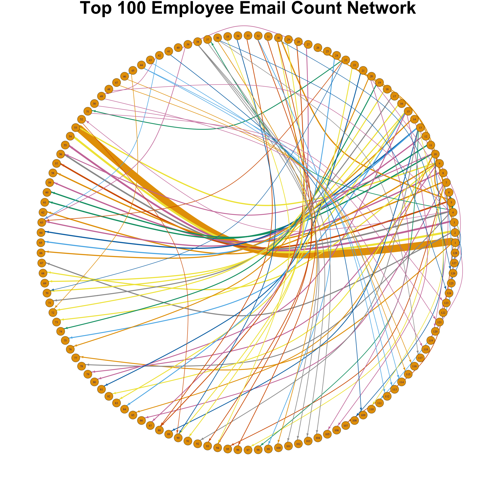

```{r setup, include=FALSE}
knitr::opts_chunk$set(echo = TRUE)
```

Abstarct
--------
Social network data from employees is essential for analyzing a company's chain of command, corporate structure and conversations relating to malfeasance. This kind of data can be useful in finding the source of corruption and fraud within a company. The collapse of Enron sent a shockwave through Wall Street and lost shareholders billions of dollars. The scandal led to new regulations to promote the accuracy of financial reporting of publicly held companies as well as billions of dollars in fines. We attempt to visualize and analyze a network of email correspondence from 175 employee user files containing incoming and outgoing emails to find suspicious activity that may have led the company to declare bankruptcy. To begin, we gather every email that was sent to or from one of our 175 users and build a social network of the top 100 paired employees by volume of email correspondence. We then isolate the largest chained network and perform leading eigenvector community detection to find densely connected subnetworks of the isolated network. Finally, we attempt keyword searches on emails within the isolated subnetworks to attempt to find the source of suspicious behavior in Enron’s upper management. The analysis resulted in finding suspicious departmental structure as well as emails containing the names of the illegal Special Purpose Vehicles (SPVs) that lead to Enron’s demise. 

Introduction
------------
Enron Corporation was an energy trading and utilities company based in Houston, Texas, that, in 2001, became the epicenter to one of the biggest cases of corporate malfeasance the US had ever seen. Shareholders lost an estimated 74 million dollars in the company’s collapse. Enron upper management took advantage of market-to-market accounting (MTM). MTM is an accounting practice that adjusts the value of a company to reflect the current market conditions. With this completely legal accounting technique, Enron was able to hide billions of dollars of debt from shareholders through Special Purpose Vehicles (SPVs) SPVs are small entities used by larger companies to fulfill a specific temporary job. Enron was creating SPVs to take on debt from certain projects such as building a power plant. With MTM accounting, Enron would take all the projected profit from a project and it would instantly be reflected in the eyes of the shareholders. 

This analysis uses 175 Enron employee incoming and outgoing mailboxes to build a social network of important members of upper management. With this social network, we can attempt to find communication patterns among the employees as well as the source of corporate fraudulence. We will utilize R and the igraph package to visualize and examine the social network as well as use keywords to search through the contents of emails to find suspicious activity. The work in R for this project can be found [HERE](https://github.com/mattymo18/Enron_Email_Analysis). 


Methodology
-----------
The first step in the analysis is to clean up our user files and build a social network of communication between the 175 users we have and the rest of the company. To do this, we first find all the people that have sent an email to one of our 175 users and all the people who our 175 people have sent an email to. This gives us a very large network of people at enron emailing our users and vice versa. We want to make sure all the emails in this network are from Enron and that there are no compromised email addresses. After cleaning up this set for issues regarding “<” symbols within corrupted emails we have a final social network of about 5000 users that have either sent or received an email to or from our 175 users. Next, we want to scale this set down quite a bit since this is a very large network. To do this, we decide to only look at the top 100 pairs of people communicating with one another. We do this because we believe the people that send the most emails to one another probably work closely together. We do not care about people that send very few emails to one another, rather we want those users who are communicating often. Also, filtering this way is likely to give us important upper management at Enron since upper management will likely send more emails than hourly workers. The plot below shows the top 30 senders and top 30 receivers of emails within this smaller network of users. 


This plot gives us an idea of the magnitude of emails we have in this set. As you can see, user d..steffes seems to send the most emails, but she does not receive many emails from others. On the flip side of that user gerald.nemec receives many emails but does not send very many. I found this to be quite interesting since it is not what would be expected. We would expect someone who receives lots of emails to respond to those emails and, in turn, send lots of emails, but that does not seem to be the case. More importantly, we see a few names of people of interest on this chart. We see users jeff.skilling, m..forney, and holden.salisbury. All three of these users seemed to have been heavily involved in the scandal according to SEC indictments and case filings. In fact, user jeff.skilling, who was CEO during the prime of the scandal, is said to be one of the masterminds behind this malfeasance. Clearly, this subset of top communicators worked in our attempt to find important people. We then take a look at the network of communication to visualize the email chains. The plot below shows these top communicating pairs with line thickness indicating how many emails are sent between them. 


As you can see, this image is a bit difficult to follow since there are lots and lots of lines overlapping. One interesting aspect of this plot though, is the seemingly massive email conversion between user 1 and 53. After inspection, this is found to be an automated announcement email that sends many emails daily, so we can disregard this. Other than this realization, this image does not really give us too much insight into the network, rather it works as a nice image capturing the communication between the pairs. To truly analyze the network we decide to move away from the circle plot and try to find groups of people that email eachother often. To do this, we plot the network in a different way that is more representative of how these pairs actually communicate. The plot below shows the same users in the circle plot, but the nodes are moved around to better show how they interact. 


This image gives us a much better picture of how these users are communicating with one another. After inspection, we can see a large group of interconnected nodes in the middle of the plot as well as other isolated networks on the border. We can guess that the isolated self-contained networks are departments at Enron since they email eachother often. This is reinforced by the “wheel and spokes” form many of these self-contained networks take. Clearly there is a manager in the center and many workers around the outside that all email the manager. This image is very useful in analyzing the corporate structure of Enron since we can see who people are speaking with in high volumes. 

We then isolated the larger interconnected network in the middle of the previous image. This was done to narrow down our search for illegal activity among the users. The large group of interconnected users in the middle seemed to contain important upper management that would have known about the malfeasance, so we turned our attention to this isolated network. This isolated network is displayed below. 


We perform leading eigenvector community detection on the isolated network to find the subnetworks of people that communicate often within the isolated network. This type of community detection uses eigenvectors of the matrix that describes the network. It involves maximizing the modularity of the network using an eigenanalysis of the modularity matrix. Further details about this method can be found in Newman’s paper [HERE](https://arxiv.org/pdf/physics/0605087.pdf). The nodes are then colored according to the results of the community detection and the edges are labeled with the number of emails sent between the pairs. We see some interesting features in this plot that could be useful in further analyzing the structure of Enron. Three main nodes stick out as ones we should further investigate: jeff.dasovich, d..steffes, and tim.belden. We know tim.belden pleaded guilty to federal charges so this user should be inspected more closely. Users jeff.dasovich and d..steffes should also be inspected because they seem to be central nodes with many surrounding users in contact. User jeff.dasovich is a government relation executive. He would have been heavily involved in making sure the SEC was not investigating Enron for any malfeasance. We believe he is a major player at Enron especially considering his direct link to known criminal tim.belden. Similar to user jeff.dasovich, user d..steffes was vice president of government affairs. We believe he also would have been important in keeping the illegal activity out of sight from government regulators. Below we plot this same network in a different form to highlight those who were receiving many emails. 


A few noticeable features of the plot above immediately stick out. The red line between users susan.mara and jeff.dasovich indicates a large number of email exchanges between the two. User susan.mara was the director for regulatory affairs, so it makes sense they were emailing the government relation executive since the jobs had similar roles. For Enron, that roll was hiding illegal activity from government regulators. User susan.mara’s job was centered around ensuring everything Enron did was legal, but at the same time they wanted to please the upper management and show off accomplishments, like being able to strategically hide debt from shareholders. 

The final part of the analysis was to examine emails sent from notable people in upper management. To do this, we completed a similar cleaning task as in the beginning of the network analysis, but we included the content from all the emails rather than just the sender and receiver. After narrowing the network back down to our isolated network displayed above, we began searching emails for keywords. 

The first keyword used was “bankrupt”. This led to finding many automated emails sent out to people whenever Enron was mentioned in the news. These emails turned out to not be very useful since they were not truly composed by employees. 

The next keyword used was “fraud”. This led to a similar set of emails that were automated everytime Enron was mentioned in the news. Again, not very useful information for the purpose of this analysis. 

The next keyword used was “Raptor”. After researching the illegal activity we were able to find some mentions of the SPVs Enron was using to hide debt. “Raptor” was the name of a few of these SPVs, so we searched this word hoping we would find mentions of other SPVs that were being used illegally. Surprisingly, only one email came from this keyword search. An email from user tim.belden to user holden.salisbury. This email is already fairly suspicious solely because of the user involved. User tim.belden was head of trading at Enron, while user holden.salisbury was a seemingly low-level employee in the west coast office. According to our maps above these two had a lot of email connections, which we believe to be suspicious. The contents of this email are more than we could have ever hoped for, in regard to finding suspicious activity between employees. Not only is “Raptor” included in the email, but so are 30 other SPVs that Enron had used to illegally hide debt. In addition to naming all of these SPVs, there are special instructions for dealing with voicemails, emails, and accounting transactions with any of these SPVs. User tim.belden is providing strict instructions to send all conversations about any of these SPVs to a special extension email account. We believe this is the beginning of the end for Enron. This seems to be user tim.belden attempting to cover the illegal tracks left from setting up all the illegal SPVs. Below is an excerpt from the email with instructions for dealing with communication with the SPVs. 

> 1. If you have any voicemails that relate in any way to the LJM Deal or Chewco Investments L.P., including any accounting issues related to these transactions, please forward the voice mails to x3-6800.

> 2. If you have any voicemails that relate in any way to Enron's public statements regarding EBS, Azurix, New Power Co., or any voice mail regarding financial transactions involving these matters, including accounting issues related to these matters, please forward the voice mails to x3-6801.

> 3. If you have any e-mails that relate in any way to the LJM Deal or Chewco Investments L.P., including any accounting issues related to these transactions, please forward the e-mails to LJM.Litigation@enron.com. 

> 4. If you have any e-mails that relate in any way to Enron's public statements regarding EBS, Azurix, New Power Co., or any e-mail regarding financial transactions involving these matters, including accounting issues related to these matters, please forward the e-mails to ClassAction.Litigation@enron.com.

We found the wording and content of this email to be very suspicious. Also, at the bottom of the email user tim.belden lists the illegal SPVs. 

> “...includes LJM Cayman L.P., LJM Co-Investment L.P., TNPC1, Margaux1, Cortez (TNPC), Osprey1, Avici, Catalytica, Fishtail (Pulp & Paper), Backbone, ENA CLO (Merlin), Nowa Sarzyna (Poland), Bob West, MEGS, Yosemite, EECC Turbines (Blue Dog), Raptor 1, Raptor 1a, Raptor 2, Raptor 2a, Raptor 3, Raptor 4, Rawhide, LJM2/WW Loan Agrmt, Osprey 2 LLC1, Rythms, Osprey, Cuiaba, and LJM Cayco Investments.”

Now, despite finding these suspicious emails, we do not have any proof of illegal activity. We only know these SPVs to be illegal after the SEC found the corporate malfeasance. Still, it is interesting to see the upper management attempting to cover their backs during the SEC investigation. 

Conclusion
-------

References
----------
1. MEJ Newman: Finding community structure using the eigenvectors of matrices, arXiv:physics/0605087